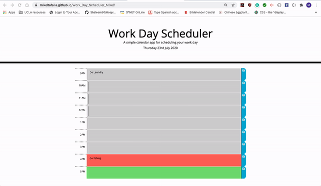

# Work_Day_Scheduler_Mikel
Work_Day_Scheduler

## Link
[Live Site](https://mikeltafalla.github.io/Work_Day_Scheduler_Mikel/)

## Table of Contents

* [Features](#features)
* [Instructions](#instructions)
* [Example Gif](#example-gif)
* [Author](#author)

### Technologies
1. Html
2. CSS
3. Jquery
4. Moment.js
5. Used Flexbox from Bootstrap
6. Used fontawesome for save icon

### Features

1. On load you'll be given current day, month and year
2. Calendar consisting on three columns.
    * Time column (regular job times from 9AM - 5PM)
    * Column to write your to-dos
    * Third column to save your to-dos
3. Third column button will save the to-dos. if you hover over the save icon, it'll change color.

### Instructions:

1. To-dos columns are color-coded (Update dynamically every hour):
    * If the time has past, the column will show grey.
    * Current time will display a red background.
    * Time to come will display a green background
2. Click on the middle column of the corresponding time where you want to add your task.
3. Click the button with the icon and your task will be saved
4. When you refresh your page or come back the following day, your task will still be there. If you want to delete your task, delete it and click save.

### Example Gif

### Author 

**MikelTafalla**

Email: mikel362d@gmail.com

Location: Santa Barbara

GitHub: https://github.com/MikelTafalla

